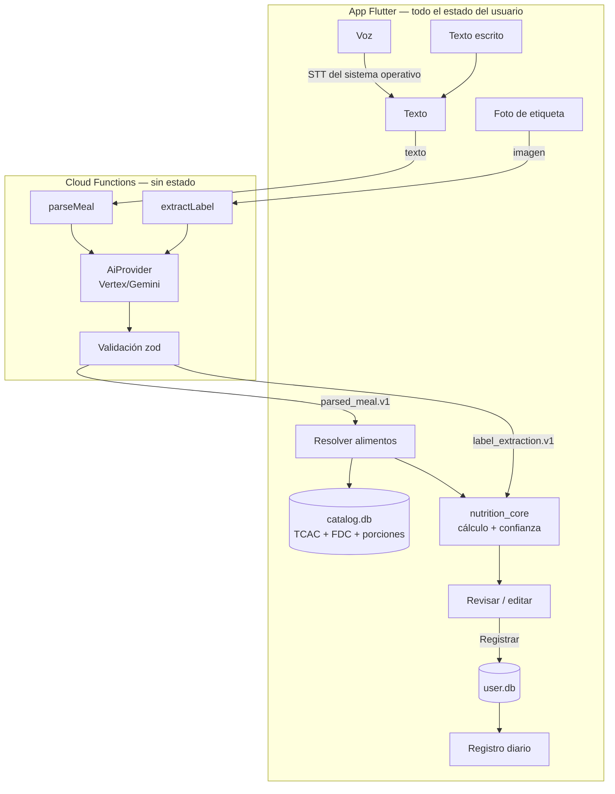

# Arquitectura — Calorías IA

Estado: vigente · Decisiones: `docs/decisions/ADR-001-decisiones-iniciales.md`

## Clasificación
Mobile + AI Application · Complejidad MODERATE · Cliente con estado local + backend mínimo sin estado.

## Vista general

## Componentes
| Componente | Responsabilidad | No hace |
|---|---|---|
| `app/features/capture` | Entrada por texto, voz y foto de etiqueta | Llamar directamente a Functions o a la base de datos |
| `app/features/review` | "Analizando" (SPEC-012: `parseMeal` vía `infra/ai_client`, resolución y cálculo con pasos visibles), detalle de comida: ítems, cantidades, kcal y confianza; editar; resolver ambigüedades; registrar | Calcular nutrientes |
| `app/features/diary` | Registro del día: comidas, kcal y macros | — |
| `app/infra/ai_client` | Llamadas callable a `parseMeal` y `extractLabel` con App Check; mapeo de errores | Lógica de negocio |
| `app/infra/catalog` | Consultas a `catalog.db` (FTS5), candidatos de alimentos y porciones | Calcular |
| `app/infra/storage` | `user.db` con Drift: comidas, ítems, productos personales | — |
| `app/infra/export` | SPEC-016: CSV (`;`, coma decimal, BOM), resumen PDF (librería `pdf`, Outfit embebida) y JSON; los escribe en el directorio temporal y los entrega al share sheet | Enviar archivos por su cuenta; calcular (promedios de `nutrition_core`) |
| `packages/nutrition_core` | Unidades, resolución de cantidades a gramos, cálculo, confianza, validación de etiquetas | E/S, red, Flutter |
| `functions/` | Validar entrada, aplicar prompt versionado, llamar al proveedor, validar salida | Persistir datos, registrar contenido, calcular nutrientes |
| `data/build_catalog` | Generar `catalog.db` desde fuentes y CSV curados | Ejecutarse en la app |

## Flujo: comida por texto o voz
1. La voz se transcribe en el dispositivo. Desde ahí es idéntica al texto.
2. `parseMeal({ text, locale: "es-CO" })` devuelve `parsed_meal.v1`: por ítem `mention`, `food_query`,
   `quantity`, `unit`, `size`, `preparation`, `is_vague` y `parent_index` (ingrediente añadido a otro ítem,
   por ejemplo el aceite del huevo revuelto). **Sin nutrientes.**
3. Resolución por ítem en el dispositivo:
   - `matched`: candidato claro (puntaje ≥ umbral y margen suficiente frente al segundo).
   - `ambiguous`: hasta 3 candidatos para que el usuario elija.
   - `not_found`: se muestra así; nunca se inventan valores.
4. `nutrition_core` resuelve gramos y calcula nutrientes y confianza.
5. El usuario revisa y edita; al registrar se guarda en `user.db` una instantánea de los valores
   (el historial no cambia si el catálogo se actualiza).

## Flujo: etiqueta nutricional (SPEC posterior)
`extractLabel(imagen)` → `label_extraction.v1` (porción, unidad, valores por porción y por 100 g si
existen, `unreadable_fields`) → validación en `nutrition_core` (Atwater ±20 %, porción > 0) → el usuario
confirma o corrige los valores → indica la cantidad consumida → cálculo → se guarda como producto
personal reutilizable.

## Flujo: comida reciente (SPEC-017)
"¿Qué comiste?" lee las últimas 50 comidas de `user.db`, deja hasta 5 distintas (mismos alimentos con
los mismos gramos) y recalcula sus kcal con el catálogo actual (`infra/food_resolution/recent_meals.dart`).
Al tocar una, el detalle se abre con un `MealDraft` (alimentos y gramos ya resueltos, la base de la
cantidad y la confianza que dieron las reglas al registrarla), **sin llamar a la IA**; se guarda como
una comida nueva con la hora actual. Una comida con un alimento que ya no existe no aparece.

**Favoritas y frecuentes (SPEC-022).** `loadQuickMeals` arma, en una sola lectura, las favoritas
(hasta 10, primero), las recientes y las frecuentes: comidas distintas registradas al menos 3 veces en
los últimos 60 días, de la más repetida a la menos, sin repetir las que ya están en Recientes. Las
favoritas guardan solo alimentos y gramos (no valores nutricionales): se abren con el catálogo actual
como un `MealDraft`, igual que una reciente; si algún alimento ya no existe, se muestran con un aviso y
no se abren. "Guardar como favorita" vive en `ui/favorite_flow.dart` (Hoy, Historial, el detalle de una
comida guardada y "¿Qué comiste?").

## Flujo: corrección conversacional (SPEC-024)
En el detalle de una comida nueva, "¿Algo no está bien? Cuéntamelo" → callable `correctMeal`
(`meal_correction.v1`, prompt `correct_meal.v1`): recibe la corrección y los ítems solo con
`mention`, `food_query`, `quantity`, `unit` y `size`, y devuelve operaciones (`replace`, `add`,
`remove`, `set_quantity`) sin valores nutricionales. Un índice fuera de rango invalida toda la
respuesta (reintento y `ai-invalid-output`). La app arma el borrador nuevo sin tocar el actual
(`ReviewController.buildCorrection`: cada ítem nuevo o cambiado se resuelve y calcula como siempre),
muestra la vista previa y, al aplicar, guarda el estado anterior para "Deshacer". No aplica en
"Editar comida".

## Flujo: búsqueda manual (SPEC-018)
"Buscar alimento" (desde "Añadir ingrediente" en el detalle o "Buscar en la base manualmente" en el
error de la IA) busca en `catalog.db` con FTS5 por prefijo (nombre y sinónimos, desde 2 letras,
hasta 20) y en los productos personales, **sin IA**. La cantidad se elige con las porciones del
alimento (unidad, tamaños, porción), medidas caseras si el alimento tiene densidad o esa porción, o
gramos; los gramos salen de `resolveGrams` y la confianza de `itemConfidence` (las mismas reglas del
texto). El resultado es un `MealDraftItem` que el detalle agrega a la comida.

## Resolución de cantidades (orden de preferencia)
| `quantity_basis` | Ejemplo | Cómo se obtienen los gramos |
|---|---|---|
| `explicit_weight` | "150 g de pollo" | Directo. Para ml: densidad del alimento; sin densidad → 1 g/ml y confianza Estimación |
| `label` | Etiqueta + "comí 45 g" | Valores de la etiqueta × cantidad / porción |
| `unit_portion` | "2 huevos" | `portions` del alimento, descriptor `unidad` |
| `size_descriptor` | "arepa pequeña" | `portions` con descriptor de tamaño |
| `household_measure` | "1 cucharada de aceite" | `household_units` (ml) × densidad del alimento |
| `default_portion` | "un poquito de queso", sin cantidad | Porción `porcion` del alimento, destacada para edición |

## Confianza
Por ítem:
| Nivel | Regla |
|---|---|
| **Alta precisión** | `label` con cantidad en g/ml |
| **Buena estimación** | Alimento del catálogo con `explicit_weight`, o `unit_portion` que no sea `is_curated_estimate` |
| **Estimación** | `size_descriptor`, `household_measure`, `default_portion`, `is_vague`, porciones curadas, ml sin densidad, o cantidad sin equivalencia en el catálogo (SPEC-043) |

**Cantidad sin equivalencia (SPEC-043).** Si `resolveGrams` no puede convertir lo dicho (p. ej.
"unidad" de un alimento sin esa porción), `fallbackResolution` de `nutrition_core` da una porción
típica (la "porcion" del alimento; si no, la primera; si no tiene, 100 g) con base `default_portion`, y
`itemConfidence(..., withoutEquivalence: true)` la deja en Estimación. El ingrediente sale destacado
("Sin equivalencia · ajústala").

Por comida: el nivel más bajo entre los ítems que aportan ≥ 15 % de las kcal de la comida.
Si ningún ítem llega al 15 %, se usa el nivel más bajo de todos.
La IA nunca reporta confianza.

**Cómo se muestra (SPEC-023).** `ui/components/confidence_indicator.dart`: círculo lleno (Alta
precisión), a medias (Buena estimación) o en contorno (Estimación), siempre con texto y etiqueta
semántica, en el tono de acento. Va en la tarjeta de kcal y en cada ingrediente del detalle, y en las
tarjetas de comida de Hoy e Historial (nivel guardado). Al tocarlo, `ui/confidence_texts.dart` explica
la regla que aplicó (deducida de la base, si era vaga y el nivel; no recalcula nada) y ofrece cómo
mejorarlo: escribir la cantidad exacta (pasa por `resolveGrams` e `itemConfidence`) o usar la etiqueta
(SPEC-033).

## Cálculo
`nutriente_item = valor_por_100g × gramos / 100`. Las sumas se hacen sin redondear. Al presentar:
kcal enteras (redondeo half-up) y macros con 1 decimal. Los valores estimados se muestran con "~".

## Modelo de datos del usuario (`user.db`)
- `meals(id, eaten_at, meal_type, confidence, catalog_version, created_at, updated_at)`
- `meal_items(id, meal_id, position, mention, food_id NULL, personal_product_id NULL, name_snapshot,
  grams, quantity_input, unit_input, size_input, quantity_basis, energy_kcal, protein_g, carbs_g, fat_g,
  confidence, source_ref)`
  - **Editar una comida guardada (SPEC-026):** se reemplaza en una transacción con el mismo `id`
    (`updated_at` cambia). Los ítems que la persona no toca conservan su instantánea (nombre y
    valores) aunque el catálogo o el producto hayan cambiado; los editados se recalculan con
    `nutrition_core` y el catálogo actual. Si el producto de un ítem se borró, se ajusta a partir de su
    instantánea y se guarda sin enlace al producto. Borrar una comida borra sus ítems.
    `meals.catalog_version` pasa a ser la versión del catálogo de la última edición (los ítems no
    tocados pueden venir de una versión anterior: su instantánea es la fuente).
- `personal_products(..., serving_unit)` y `personal_product_aliases(product_id, term)`: productos de
  etiquetas confirmadas (SPEC-004/033) con su unidad y los nombres con que la persona los llama
  (SPEC-034, `user.db` v8).
- `personal_products.brand` (SPEC-025, `user.db` v10): marca opcional del producto. Al reconocer
  (`FoodQueryResolver.resolve(foodQuery, mention:)`), si la frase trae como palabra(s) completa(s) la
  marca de algún producto, se eligen los productos de esa marca cuyo nombre o alias contiene el resto
  de la consulta (uno → ese; varios → "¿Cuál de estos?"); si ninguno coincide, se resuelve como antes y
  el detalle avisa. El nombre o alias exacto (SPEC-034) va primero. Sin cambios de IA.
- `favorite_meals(id, name, created_at)` y `favorite_meal_items(favorite_id, position, food_id,
  mention, grams, quantity_input, unit_input, size_input, quantity_basis, confidence)`: comidas
  favoritas (SPEC-022, `user.db` v9). `food_id` es el id del catálogo o `personal:<id>`.
- `user_profile(id=0, sex, birth_date, height_cm, weight_kg, activity_level,
  measured_maintenance_kcal NULL, updated_at)`: perfil (SPEC-008, `user.db` v6).
- `nutrition_goals(id=0, objective, is_manual, energy_kcal, protein_g, carbs_g, fat_g, updated_at)`:
  meta diaria vigente, fila única, sin historial (SPEC-008).
- `weight_log(day PK, weight_kg, updated_at)`: historial de peso, un registro por día (SPEC-015,
  `user.db` v7). `user_profile.weight_kg` siempre es el registro más reciente: anotar o borrar un
  peso actualiza el perfil y recalcula una meta de objetivo en la misma transacción
  (`infra/storage/goal_sync.dart`, compartido por Mi perfil y Progreso). El cambio de la semana se
  calcula en `nutrition_core` (`weight_trend.dart`).

## Objetivos (SPEC-008)
- Metabolismo basal: Harris-Benedict 1918. Mantenimiento: basal × factor de actividad, con la escala
  de las calculadoras de fitness (5 niveles: 1,2 / 1,375 / 1,55 / 1,725 / 1,9). **Esa escala no
  tiene fuente institucional** (PV-14): es una decisión de producto validada con datos medidos por
  reloj de la usuaria. Si la persona escribe su **mantenimiento medido**, ese manda sobre la
  fórmula.
- Objetivo: −250 / −500 kcal, mantener, +10 / +20 %. Macros en % de las kcal según el objetivo
  (decisión de producto dentro de los AMDR). Fuentes: `docs/research/2026-10-02-harris-benedict-actividad-objetivo.md`.
- Todo en `nutrition_core`, en el dispositivo. La meta de un objetivo se recalcula al guardar el
  perfil (en la misma transacción); la meta manual queda fija.
- El progreso del día (`GoalProgress`) resta sin redondear y redondea al presentar, en tono neutro.
  `GoalProgress.ratio` (sin tope) y `presentPercent` dan el "% de tu meta" del Historial (SPEC-013).
- Estado del día (SPEC-011, `day_status.dart`): por debajo < 90 % de la meta ≤ en tu meta ≤ 110 % <
  por encima (tolerancia: decisión de producto). Todos los días se comparan con la meta vigente.

## Progreso (SPEC-014)
- `period_summary.dart` en `nutrition_core`: promedio diario de kcal y macros **solo sobre los días
  con al menos un registro** (decisión de producto: un día sin registros no es un día en 0), días en
  meta con la regla de SPEC-011 y promedios por semana (lunes a domingo). Sin redondear hasta
  presentar. La app agrupa las comidas por la fecha local de `eaten_at` con una sola consulta por
  periodo (7, 30 o 90 días, hoy incluido): `mealsBetween` lee las comidas y luego todos sus ítems en
  lote.

## Interfaz (SPEC-010)
- Tokens y tema en `app/lib/ui/theme.dart` (`KColors`, `DayGoalStatus`, `buildAppTheme()`); ninguna
  pantalla repite colores. Componentes en `app/lib/ui/components/` (tarjeta, anillo de progreso,
  barra inferior, estado vacío). Los anillos solo dibujan fracciones calculadas en `nutrition_core`.
- Flujos compartidos entre features en `app/lib/ui/*_flow.dart` (por ejemplo, el menú de una comida
  de SPEC-037): pueden usar `infra/` y `app_routes.dart`, nunca `features/`. Los componentes de
  `ui/components/` siguen siendo solo presentación.
- Tipografía Outfit embebida como asset (SIL OFL 1.1); nunca se descarga.
- Pantallas principales Hoy / Historial / Progreso con `MainNavBar` (rutas sin animación); el resto
  se abre encima, sin barra. Los estados del día frente a la meta nunca usan rojo ni verde de alarma.

## Errores
| Situación | Comportamiento |
|---|---|
| Sin red | Mensaje en español con opción de reintentar; el texto ya escrito se conserva |
| Timeout del proveedor (10 s el texto; 60 s la etiqueta, SPEC-029) | Igual que sin red |
| `ai-invalid-output` | "No pude entender la comida, ¿puedes reformularla?" |
| Sin alimentos detectados | "No encontré alimentos en lo que escribiste" |
| App Check inválido | Error genérico; se registra solo el código |

## Backend: controles
- App Check obligatorio en funciones callable. En desarrollo se usa el proveedor de depuración.
- Entrada: texto de 1–500 caracteres; imagen ≤ tamaño definido en la SPEC de etiquetas.
- `maxInstances` acotado, timeout de 10 s hacia el proveedor (60 s en `extractLabel`, SPEC-029), alertas de presupuesto en Google Cloud.
- Modelo y región por configuración (POR VERIFICAR, ver `docs/research/POR-VERIFICAR.md`).
- Proveedor de IA por ambiente (`fake` por defecto; SPEC-029, `functions/src/ai/provider_name.ts`):
  el backend desplegado en `kcalcula-ia-dev` usa `vertex` (`gemini-2.5-flash`, `us-east1`) por
  `DEPLOYED_AI_PROVIDER=vertex`, `VERTEX_PROJECT_ID`, `VERTEX_LOCATION` y `GEMINI_MODEL_ID` en
  `functions/.env.kcalcula-ia-dev` (fuera de git, sin secretos; `firebase deploy --non-interactive`
  exige los cuatro), con la cuenta de servicio de Functions y `roles/aiplatform.user`. El emulador
  ignora `DEPLOYED_AI_PROVIDER` y solo obedece `AI_PROVIDER` (línea de comandos o `.env.local`).
