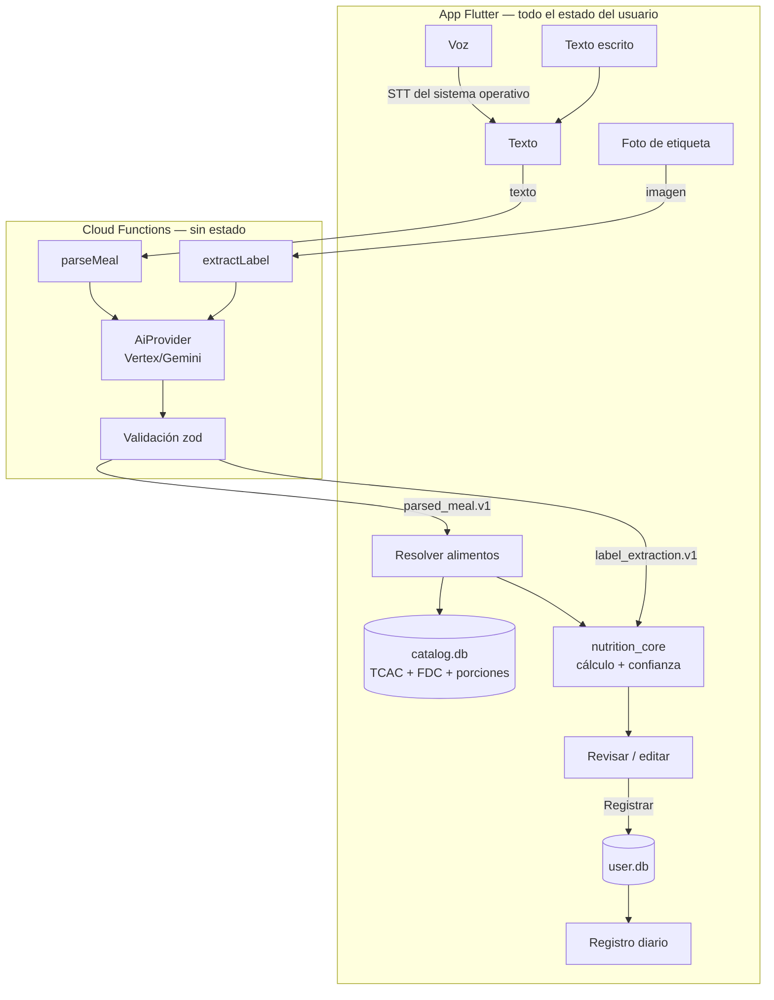

# Arquitectura — Calorías IA

Estado: vigente · Decisiones: `docs/decisions/ADR-001-decisiones-iniciales.md`

## Clasificación
Mobile + AI Application · Complejidad MODERATE · Cliente con estado local + backend mínimo sin estado.

## Vista general

## Componentes
| Componente | Responsabilidad | No hace |
|---|---|---|
| `app/features/capture` | Entrada por texto, voz y foto de etiqueta | Llamar directamente a Functions o a la base de datos |
| `app/features/review` | Mostrar ítems, cantidades, kcal y confianza; editar; resolver ambigüedades; registrar | Calcular nutrientes |
| `app/features/diary` | Registro del día: comidas, kcal y macros | — |
| `app/infra/ai_client` | Llamadas callable a `parseMeal` y `extractLabel` con App Check; mapeo de errores | Lógica de negocio |
| `app/infra/catalog` | Consultas a `catalog.db` (FTS5), candidatos de alimentos y porciones | Calcular |
| `app/infra/storage` | `user.db` con Drift: comidas, ítems, productos personales | — |
| `packages/nutrition_core` | Unidades, resolución de cantidades a gramos, cálculo, confianza, validación de etiquetas | E/S, red, Flutter |
| `functions/` | Validar entrada, aplicar prompt versionado, llamar al proveedor, validar salida | Persistir datos, registrar contenido, calcular nutrientes |
| `data/build_catalog` | Generar `catalog.db` desde fuentes y CSV curados | Ejecutarse en la app |

## Flujo: comida por texto o voz
1. La voz se transcribe en el dispositivo. Desde ahí es idéntica al texto.
2. `parseMeal({ text, locale: "es-CO" })` devuelve `parsed_meal.v1`: por ítem `mention`, `food_query`,
   `quantity`, `unit`, `size`, `preparation`, `is_vague` y `parent_index` (ingrediente añadido a otro ítem,
   por ejemplo el aceite del huevo revuelto). **Sin nutrientes.**
3. Resolución por ítem en el dispositivo:
   - `matched`: candidato claro (puntaje ≥ umbral y margen suficiente frente al segundo).
   - `ambiguous`: hasta 3 candidatos para que el usuario elija.
   - `not_found`: se muestra así; nunca se inventan valores.
4. `nutrition_core` resuelve gramos y calcula nutrientes y confianza.
5. El usuario revisa y edita; al registrar se guarda en `user.db` una instantánea de los valores
   (el historial no cambia si el catálogo se actualiza).

## Flujo: etiqueta nutricional (SPEC posterior)
`extractLabel(imagen)` → `label_extraction.v1` (porción, unidad, valores por porción y por 100 g si
existen, `unreadable_fields`) → validación en `nutrition_core` (Atwater ±20 %, porción > 0) → el usuario
confirma o corrige los valores → indica la cantidad consumida → cálculo → se guarda como producto
personal reutilizable.

## Resolución de cantidades (orden de preferencia)
| `quantity_basis` | Ejemplo | Cómo se obtienen los gramos |
|---|---|---|
| `explicit_weight` | "150 g de pollo" | Directo. Para ml: densidad del alimento; sin densidad → 1 g/ml y confianza Estimación |
| `label` | Etiqueta + "comí 45 g" | Valores de la etiqueta × cantidad / porción |
| `unit_portion` | "2 huevos" | `portions` del alimento, descriptor `unidad` |
| `size_descriptor` | "arepa pequeña" | `portions` con descriptor de tamaño |
| `household_measure` | "1 cucharada de aceite" | `household_units` (ml) × densidad del alimento |
| `default_portion` | "un poquito de queso", sin cantidad | Porción `porcion` del alimento, destacada para edición |

## Confianza
Por ítem:
| Nivel | Regla |
|---|---|
| **Alta precisión** | `label` con cantidad en g/ml |
| **Buena estimación** | Alimento del catálogo con `explicit_weight`, o `unit_portion` que no sea `is_curated_estimate` |
| **Estimación** | `size_descriptor`, `household_measure`, `default_portion`, `is_vague`, porciones curadas, o ml sin densidad |

Por comida: el nivel más bajo entre los ítems que aportan ≥ 15 % de las kcal de la comida.
Si ningún ítem llega al 15 %, se usa el nivel más bajo de todos.
La IA nunca reporta confianza.

## Cálculo
`nutriente_item = valor_por_100g × gramos / 100`. Las sumas se hacen sin redondear. Al presentar:
kcal enteras (redondeo half-up) y macros con 1 decimal. Los valores estimados se muestran con "~".

## Modelo de datos del usuario (`user.db`)
- `meals(id, eaten_at, meal_type, confidence, catalog_version, created_at, updated_at)`
- `meal_items(id, meal_id, position, mention, food_id NULL, personal_product_id NULL, name_snapshot,
  grams, quantity_input, unit_input, size_input, quantity_basis, energy_kcal, protein_g, carbs_g, fat_g,
  confidence, source_ref)`
- `personal_products(...)`: se define en la SPEC de etiquetas.
- `user_profile(id=0, sex, birth_date, height_cm, weight_kg, activity_level,
  measured_maintenance_kcal NULL, updated_at)`: perfil (SPEC-008, `user.db` v6).
- `nutrition_goals(id=0, objective, is_manual, energy_kcal, protein_g, carbs_g, fat_g, updated_at)`:
  meta diaria vigente, fila única, sin historial (SPEC-008).

## Objetivos (SPEC-008)
- Metabolismo basal: Harris-Benedict 1918. Mantenimiento: basal × factor de actividad, con la escala
  de las calculadoras de fitness (5 niveles: 1,2 / 1,375 / 1,55 / 1,725 / 1,9). **Esa escala no
  tiene fuente institucional** (PV-14): es una decisión de producto validada con datos medidos por
  reloj de la usuaria. Si la persona escribe su **mantenimiento medido**, ese manda sobre la
  fórmula.
- Objetivo: −250 / −500 kcal, mantener, +10 / +20 %. Macros en % de las kcal según el objetivo
  (decisión de producto dentro de los AMDR). Fuentes: `docs/research/2026-10-02-harris-benedict-actividad-objetivo.md`.
- Todo en `nutrition_core`, en el dispositivo. La meta de un objetivo se recalcula al guardar el
  perfil (en la misma transacción); la meta manual queda fija.
- El progreso del día (`GoalProgress`) resta sin redondear y redondea al presentar, en tono neutro.
- Estado del día (SPEC-011, `day_status.dart`): por debajo < 90 % de la meta ≤ en tu meta ≤ 110 % <
  por encima (tolerancia: decisión de producto). Todos los días se comparan con la meta vigente.
## Interfaz (SPEC-010)
- Tokens y tema en `app/lib/ui/theme.dart` (`KColors`, `DayGoalStatus`, `buildAppTheme()`); ninguna
  pantalla repite colores. Componentes en `app/lib/ui/components/` (tarjeta, anillo de progreso,
  barra inferior, estado vacío). Los anillos solo dibujan fracciones calculadas en `nutrition_core`.
- Tipografía Outfit embebida como asset (SIL OFL 1.1); nunca se descarga.
- Pantallas principales Hoy / Historial / Progreso con `MainNavBar` (rutas sin animación); el resto
  se abre encima, sin barra. Los estados del día frente a la meta nunca usan rojo ni verde de alarma.

## Errores
| Situación | Comportamiento |
|---|---|
| Sin red | Mensaje en español con opción de reintentar; el texto ya escrito se conserva |
| Timeout del proveedor (10 s) | Igual que sin red |
| `ai-invalid-output` | "No pude entender la comida, ¿puedes reformularla?" |
| Sin alimentos detectados | "No encontré alimentos en lo que escribiste" |
| App Check inválido | Error genérico; se registra solo el código |

## Backend: controles
- App Check obligatorio en funciones callable. En desarrollo se usa el proveedor de depuración.
- Entrada: texto de 1–500 caracteres; imagen ≤ tamaño definido en la SPEC de etiquetas.
- `maxInstances` acotado, timeout de 10 s hacia el proveedor, alertas de presupuesto en Google Cloud.
- Modelo y región por configuración (POR VERIFICAR, ver `docs/research/POR-VERIFICAR.md`).
